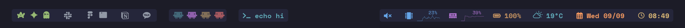

# if.bar



The empty middle is cut out; the bar spans the whole display width.

A Lua configuration for [sketchybar](https://github.com/FelixKratz/SketchyBar):
app icons, system status, weather, the command your shell is running, and one
indicator per live Claude Code session. It runs as a single resident Lua process
talking to sketchybar over kernel IPC, so widgets update through event callbacks
rather than by forking a shell.

## Install

Needs macOS and [Homebrew](https://brew.sh); the script pulls everything else.

```bash
curl -fsSL https://raw.githubusercontent.com/if-then-end/if.bar/main/scripts/install.sh | bash
```

It clones this repo into `~/.config/sketchybar`, moving any existing config
aside first, then starts the bar.

> [!NOTE]
> Building the app icon font runs the upstream project's own install and build,
> at whatever its default branch points to. Pass a commit to
> `scripts/update-app-font.sh` to pin it.

[yabai](https://github.com/koekeishiya/yabai) is optional, and only the `space`
widget needs it.

Update with `scripts/update.sh`. App icons come from a separate font that a pull
does not carry, so refresh those with `scripts/update-app-font.sh`.

When something looks wrong, `ifbar doctor` reports what is missing or broken.
It needs building once, and Go is the only thing it needs:

```bash
cd ~/.config/sketchybar/cli && go build -o ../bin/ifbar .
~/.config/sketchybar/bin/ifbar doctor
```

<details>
<summary>Manual install</summary>

```bash
brew tap FelixKratz/formulae
brew install sketchybar jq lua pnpm
brew install --cask font-space-mono-nerd-font

git clone https://github.com/FelixKratz/SbarLua.git /tmp/SbarLua \
  && (cd /tmp/SbarLua && make install) && rm -rf /tmp/SbarLua

git clone https://github.com/if-then-end/if.bar ~/.config/sketchybar
~/.config/sketchybar/scripts/update-app-font.sh

brew services restart sketchybar
```

</details>

## Configuration

```bash
cd ~/.config/sketchybar && cp ifbarrc.example ifbarrc
```

Every setting is listed and commented there. The file is parsed rather than
executed: `NAME=value` lines count, with or without `export`, and nothing else
in it runs. Reload with `sketchybar --reload`.

Widgets are three space-separated lists, in display order:

```bash
export IF_BAR_WIDGETS_LEFT_ENABLED="space claude running_command last_command"
export IF_BAR_WIDGETS_CENTER_ENABLED="front_app"
export IF_BAR_WIDGETS_RIGHT_ENABLED="clock weather caffeinate volume battery disk ram cpu"
```

`space` (yabai spaces with app icons) · `front_app` · `clock` · `calendar` ·
`weather` · `battery` · `disk` · `ram` · `cpu` · `netstat` · `volume` ·
`caffeinate` · `last_command` · `running_command` · `claude`

Eleven themes ship with it, `onedark` by default:

```bash
export IF_BAR_THEME="nord"
```

## Integration

### Shell

`last_command` and `running_command` need a zsh hook. The shell reports the
command, so any terminal emulator works.

```zsh
ln -sf ~/.config/sketchybar/hooks/zsh-integration.zsh "$ZDOTDIR/functions/sketchybar.zsh"
echo 'source "$ZDOTDIR/functions/sketchybar.zsh"' >> "$ZDOTDIR/.zshrc"
```

> [!CAUTION]
> These widgets put your commands on screen. The hook masks what looks like a
> secret - `password`, `token`, `bearer`, credentials in a URL and similar - but
> it matches on keywords and is best effort, not a guarantee. Whatever gets
> through is visible to screen shares and screenshots. Leave both widgets out if
> that is not a trade you want.

### Claude Code

```bash
ln -sf ~/.config/sketchybar/hooks/claude-sessions.py \
  ~/.claude/hooks/sketchybar-claude-sessions.py
ln -sf ~/.config/sketchybar/hooks/claude-command.sh \
  ~/.claude/hooks/sketchybar-claude-command.sh
```

In `~/.claude/settings.json`, add
`python3 ~/.claude/hooks/sketchybar-claude-sessions.py` to `SessionStart`,
`SessionEnd`, `UserPromptSubmit`, `Stop` and `Notification`, and
`sh ~/.claude/hooks/sketchybar-claude-command.sh` to `PreToolUse` and
`PostToolUse` with a `Bash` matcher. Those arrays take more than one entry.

Each session gets a color, dimmed when idle, pulsing while Claude works, and
bright and steady when it is blocked on your answer. Both hooks swallow every
error and exit 0, so a broken bar cannot disturb a session, and the session ids
they track live in `~/.local/state/if.bar/`, created owner-only.

## Credits

[sketchybar](https://github.com/FelixKratz/SketchyBar) and
[SbarLua](https://github.com/FelixKratz/SbarLua) by FelixKratz ·
[sketchybar-app-font](https://github.com/kvndrsslr/sketchybar-app-font) by
kvndrsslr

## License

MIT
